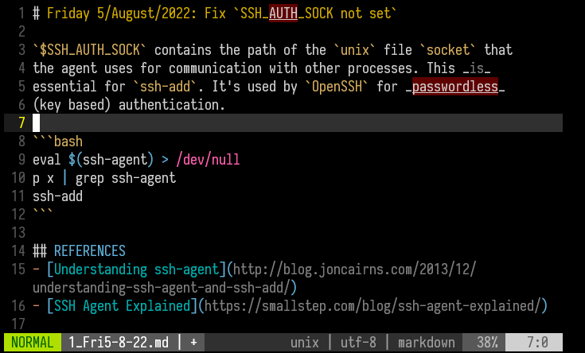
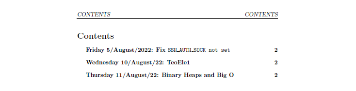
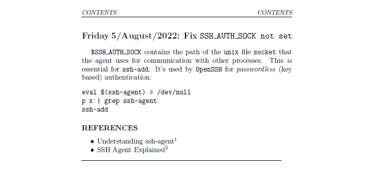

# Compilation guide

This template aims to agile the process of take daily notes, personal
diary, etc. All the entries are intended to be written in `Markdown`,
the LaTeX template is completely automated through a `Makefile`. Also
a *Contents Table* is generated.

Almost all basic `Markdown` syntax features (code blocks, citations,
pipe tables, footnotes, etc.) are supported. I suggest the
[Markdown Cheat-sheet](https://www.markdownguide.org/cheat-sheet/) to
get started with `Markdown`. If some features are not working, please
raise a ticket.


## Download

To get locally this template you could run
```bash
svn export https://github.com/DanEscher98/Escritos/trunk/Templates/MdTexDiary
```

If you hadn't installed the `svn` command, simply type
```bash
sudo apt -y install subversion
```


## Usage

To create your first note, type `just note` and it will create a
`Markdown` file with the current date as name and at the header.
You can see the available commands with `just --list`


A `Makefile` is provide alongside the `Justfile`. It's located at the `src/`
directory. Use the one you like the most. You can see the available `just`
recipes with `just --list`
```txt
Available recipes:
    clear   # Remove unnecesary files after compile
    compile # Compiles the main.txt to pdf
    note    # New entry with date as name, default editor `vi`
    open    # Open the pdf with `evince`
    restore # Restore complete names from src/titles.txt
```

To compile and generate the `pdf` file run `just compile`. By default, the
`pdf` will be named the same as the parent directory. These are some
examples of the results.





## Dependencies

Its supposed that you had `pdflatex` command in your `Linux` distro.
Although theoretically it could run on a `Windows` machine doing minor
changes on the script, this has not been tested. To install the full
`LaTeX` package type
```bash
# Ubuntu based distros
sudo apt -y install texlive-full

# Fedora Linux
sudo dnf install texlive-collection-latexextra texlive-gobble
```

Also, [`just`](https://github.com/casey/just) is used to easy usage, instead of
`make`. The easiest way to install is using the
[Github Cli](https://github.com/cli/cli/blob/trunk/docs/install_linux.md) and its
extension [`install`](https://github.com/redraw/gh-install)
```bash
gh install casey/just
```


## Common troubleshooting

If for some reason the `just` recipe fails at the `pdflatex` compilation
step, all the files at `pages/` will be left renamed with just its
position number. To restore the full name, type `just rename`.

Please DO NOT remove the `src/titles.txt` file, the `format.sh` script
depends on its existence to recover the names.
